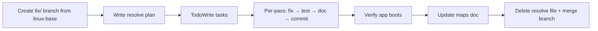

# Resolve Template — JustHireMe Fix Pass

Copy this file, name it `<module-name>.md`, place in `docs/maps/resolve/`.
Delete the folder when all modules are done.

---

## Workflow (per module)



## Rules (from previous resolves)

1. **Branch first** — `fix/<module-slug>`, branch off `linux-base` per git-workflow.md
2. **TodoWrite** — before any code change, list all passes with status
3. **Horizontal by severity** — 🔴 DEAD → 🔵 HARDCODED → 🟠 STALE → 🟡 SUSPECT → 🟢 CLEAN (inspect only)
4. **Commit per pass** — `fix: description` prefix, atomic commits. Each commit: change → test subset → verify app boots.
5. **TEST_DOCS.md** — update test count every time a test changes (adds/removes/renames)
6. **Comments & docstrings** — add to every file touched. Mark what was resolved and why.
7. **Maps doc update** — after all passes, update the source `docs/maps/<module>.md`:
   - Mark resolved flags: replace 🔵/🔴/🟠 with ✅ RESOLVED
   - Remove deleted entries (dead code removed)
   - Update file inventory flags
   - Update exports, dependencies if changed
   - Update first principles assessment
8. **Merge & clean** — merge to `linux-base`, delete branch, `git rm docs/maps/resolve/<module>.md`
9. **App boots** — after every change: `uv run python -c "from main import app; print(len(app.routes))"`
10. **Verify plan against source first** — read actual code files before touching anything. Confirm every flagged item is real.
11. **Re-check every change** — test viability (tests actually run, not idle), ripple effects, comment/doc updates.
12. **No false "domain data" dismissal** — hardcoded URLs are NOT domain data. URLs are config-viable.
13. **No-code review before merge** — review pass over all changes, then update map file, delete resolve file, merge & delete branch.


---

## Template: `<Module Name>`

### Slice strategy

_Choose one:_
- **Horizontal by severity** — uniform pattern per severity (efficient for similar fixes)
- **Vertical by file** — one file fully resolved at a time (better for deep refactors)

---

### Pass 1: 🔴 DEAD code removal

| Field | Value |
|-------|-------|
| Item | `Name` — `file.py:line` |
| Action | Delete / consolidate |
| Risk | None / Low / Medium |
| Test | `pytest tests/test_xxx.py` |

**Files:**
- `backend/xxx.py`
- `tests/test_xxx.py` (update imports)

---

### Pass 2: 🔵 HARDCODED values → config

| Value | Config key | Files |
|-------|-----------|-------|
| `"literal"` | `settings.xxx.yyy` | `file.py` |

---

### Pass 3: 🟠 STALE cleanup

| Item | Files | Action |
|------|-------|--------|
| `old_thing` | `file.py` | Remove / update consumers |

---

### Pass 4: 🟡 SUSPECT investigation

| Item | Files | Result |
|------|-------|--------|
| `thing` | `file.py` | Fixed / Noted / Deferred |

---

### Pass 5: 🟢 CLEAN verification

| Item | Files | Verdict |
|------|-------|---------|
| `thing` | `file.py` | Still clean — no changes needed |

---

### Verification

```bash
cd backend && uv run python -c "from main import app; print(f'{len(app.routes)} routes')"
cd backend && uv run python -m pytest tests/ -q --tb=short
```

---

## After all passes

1. `git add -A && git commit -m "docs: update <module>.md and TEST_DOCS.md"`
2. `git checkout linux-base && git merge --no-ff fix/<module-slug> -m "Merge: fix/<module-slug>"`
3. `git branch -d fix/<module-slug>`
4. `git rm docs/maps/resolve/<module>.md && git commit -m "chore: remove resolve tracking"`
